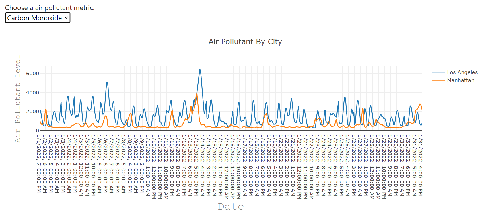
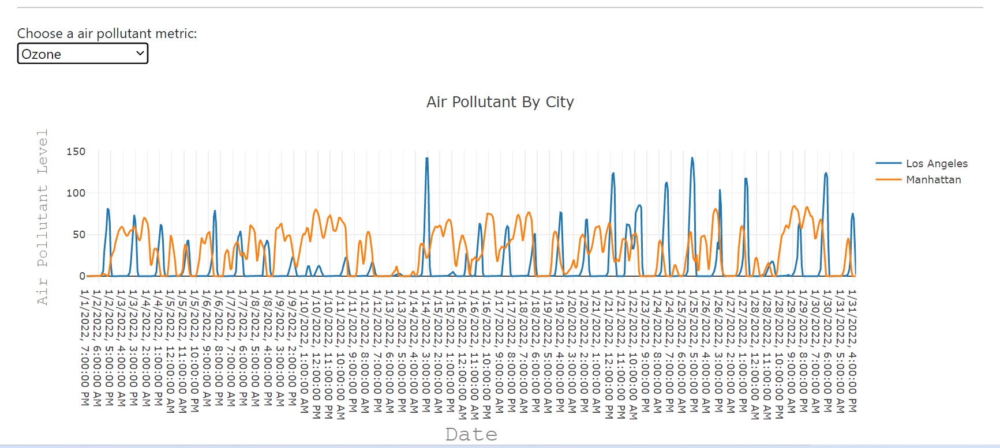
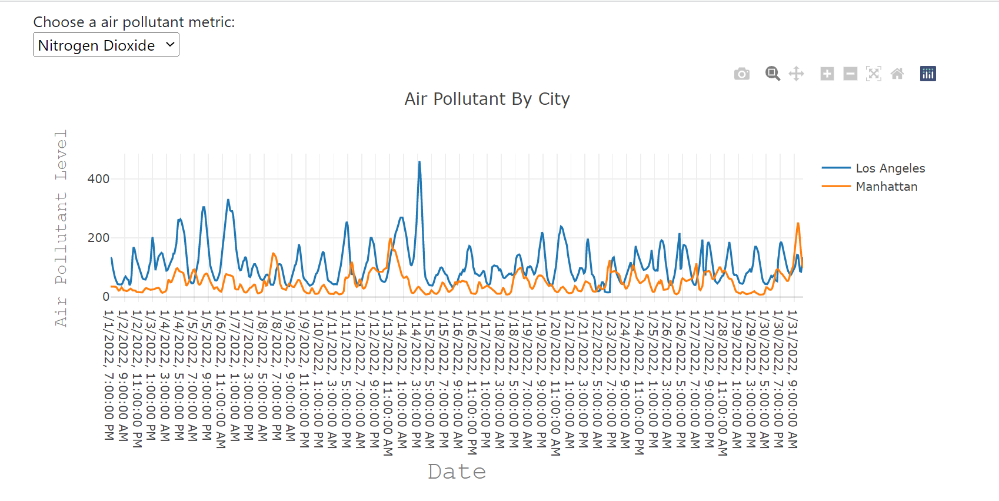
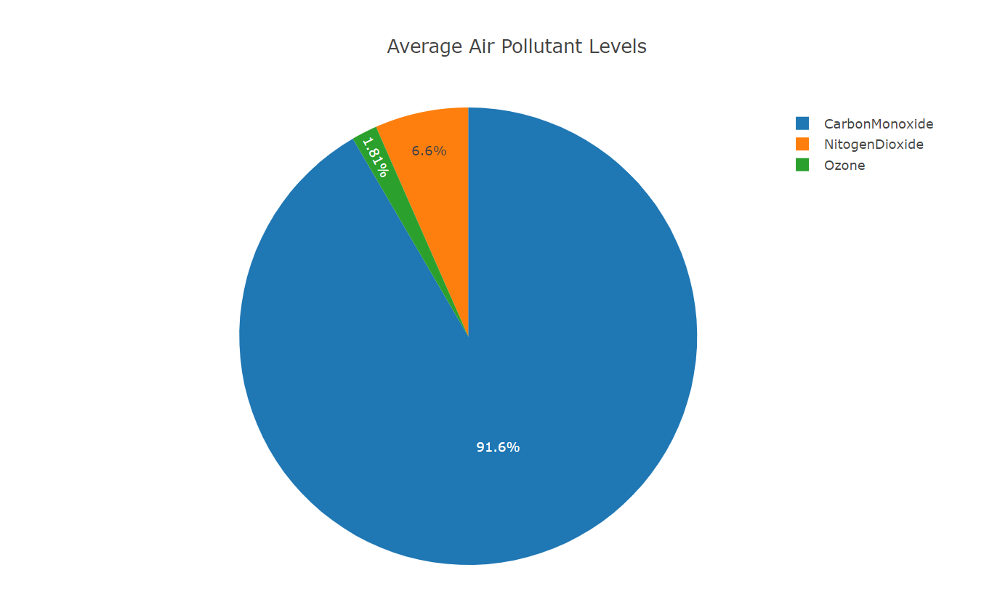
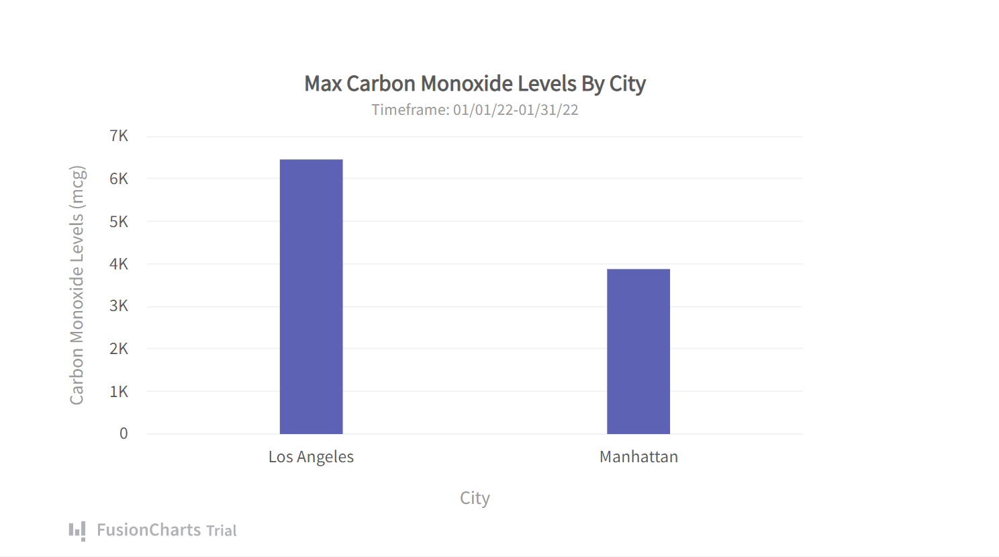

# Air Pollution Levels: Los Angeles Vs Manhattan

## Purpose

The purpose of this project is to visually show the difference between the air pollutant levels in Los Angeles and Manhattan for a one-month time period.
  

### Technologies Used:

* Python API
* PostGreSQL
* Python Flask
* HTML
* JavaScript
* CSS 
  

### Data Source: Open Weather 

* The Application Processing Interface [(API)](https://www.ibm.com/cloud/learn/api) returns data on air pollutants such as Carbon monoxide [(CO)](https://www.cdc.gov/co/faqs.htm), Nitrogen dioxide [(NO2)](https://www.epa.gov/no2-pollution), and Ozone [(O3)](https://www.epa.gov/ozone-pollution-and-your-patients-health/what-ozone#:~:text=Ozone%20(O3)%20is%20a%20highly,either%20good%20or%20bad%20ways.).
* Timeframe Pulled: 01/01/22-01/31/22
* Click [here](https://openweathermap.org/api/air-pollution) for more information about the API.
  

### High-Level Overview:
* We utilized Python API to pull historical air pollution data onto a Jupyter Notebook. From there, we used Pandas to prep our data set for PostGres. This includes filtering for relevant data, converting unix time stamp to normal date time, and creating a dataframe to house our clean data. We also created an engine to form a connection between our Jupyter Notebook and the database in PostGres. Before passing our information, we confirmed that our database, air_pollution_forecast, was running.
  

* We then created our Flask routes. By doing so, we'll be able to call on the data that's stored in Postgres database. Next, we ran our python file in terminal and lastly, we used HTML to render the data, CSS for presentation and content, and JavaScript to read the data from Flask API.
  

## Visualizations
#### Air Pollutant By City - Carbon Monoxide

  

#### Air Pollutant By City - Ozone

  

#### Air Pollutant By City - Nitrogen Dioxide

  

#### Average Air Pollutant Levels

  

#### Max Carbon Monoxide Levels By City

